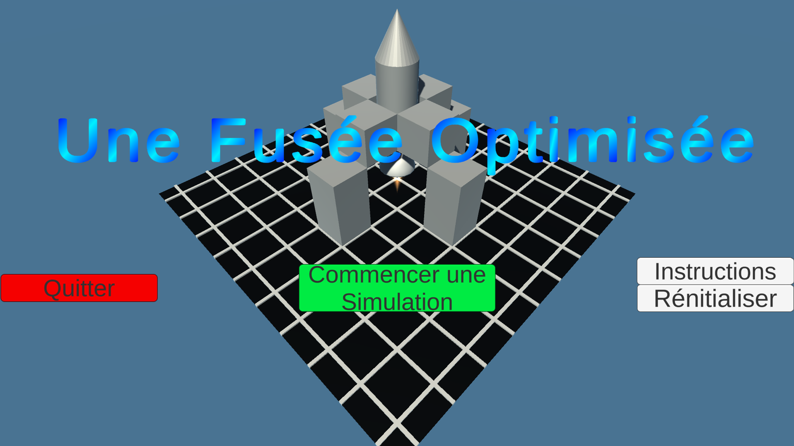
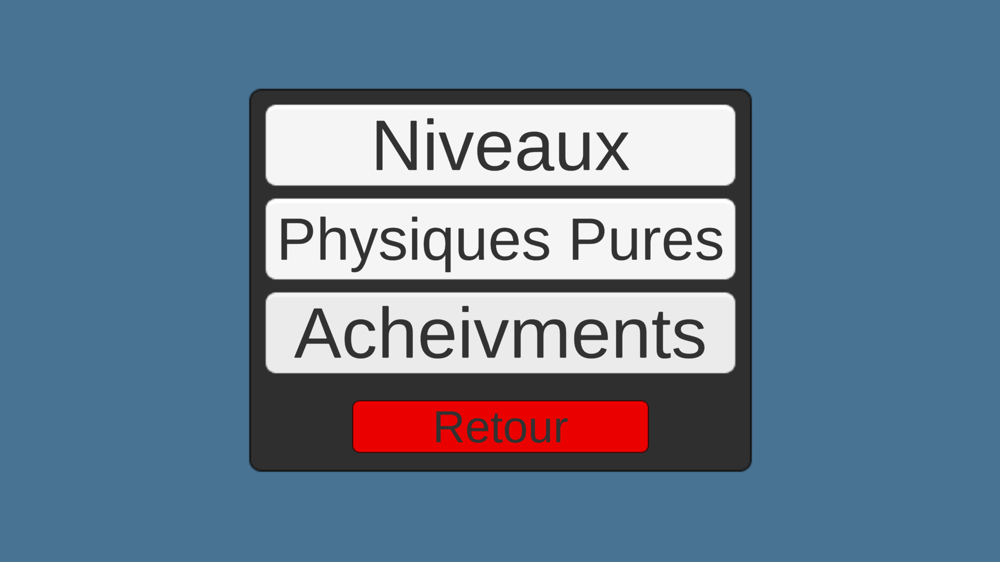
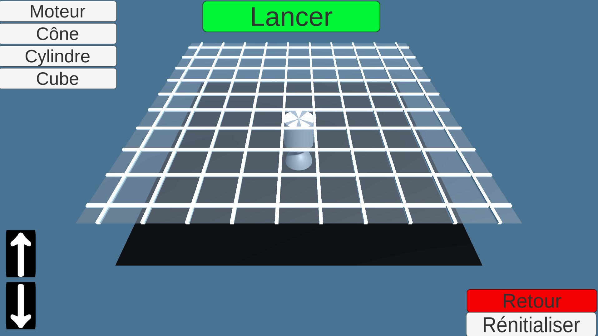
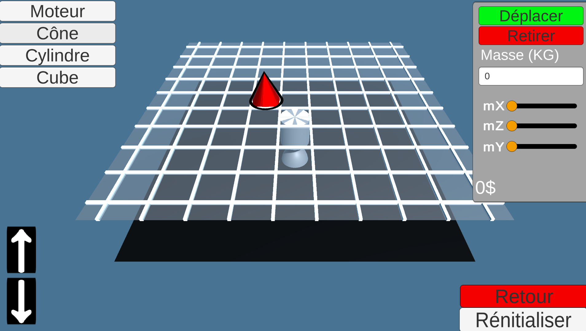
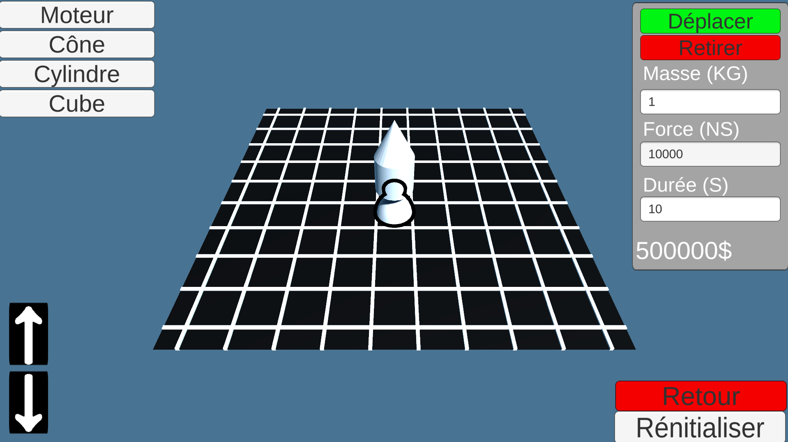
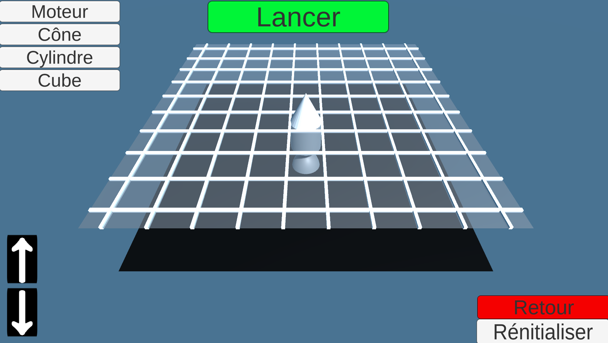
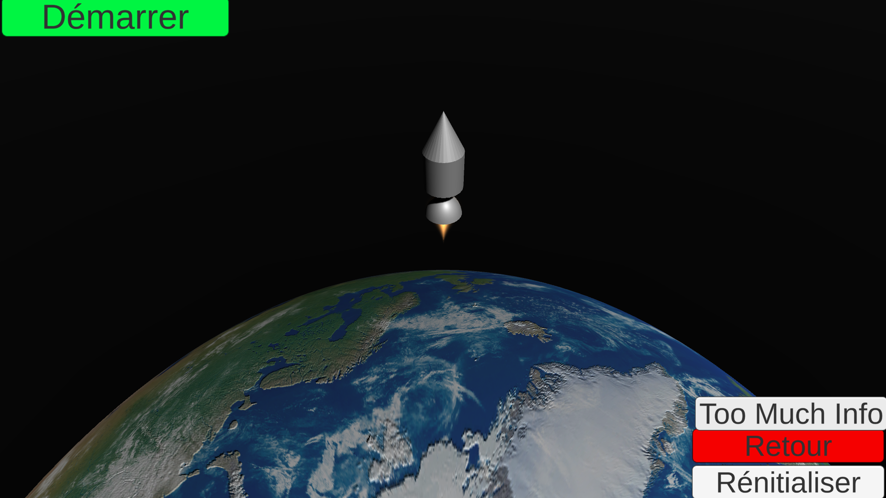

# Rocket Simulator
## Description
Ce projet a été réalisé dans le cadre du concour Exposcience en 2024. Le projet est un simulateur de fusée qui a été réalisé avec Unity 2022.3.8f1. Ainsi, l'utilisateur peut construire sa fusée et metre ses paramètres afin de voire à quelle altitudes la fusée va atteindre. La gravité, la résitance à l'air et les forces d'impulsion sont pris en compte. Pour plus de détail, vous pouver lire le raport situé dans le répertoire ....

## Démo visuel
Ceci est le menu d'acceuil où tu peux quitter l'application, commencer une simulation, consulter les instructions du programme ou rénitialiser les statistiques

Lorsque tu commences une simulation, tu as 4 options.
- L'option niveau permet de construire une fusée selon des contraintes que tu t'imposes. Ensuite, tu peux voire si tu réussi à t'améliorer ou non.
- Physiques pure permet de tester des fusées sans limite.
- Acheviment permet de voire les records et les statistiques

Ensuite, si tu as choisis l'option niveau ou physique pure, tu peux commencer la construction de la fusée en mettant des cubes, des cônes, des moteurs ou des cylindres. 

Les objects sont en rouge lorsqu'ils ne peuvent être placé et vert lorsque le placement est correct.

Ensuite, tu peux parametriser chacun des paramètres de l'object. Toutes composants peut avoir une masse définit et une taille. En plus, l'impulsion du moteur peut est sélectionné et sa durré de propulsion.

Voici à quoi peut ressembler une fusée construite. Une fois terminer, appuyerr lancer pour commencer la simulation.

Voici à quoi ressemble notre simulation une fois lancé en regardant la vidéo suivante.
<figure class="video_container">
  <iframe src="./Docs/film.mp4" frameborder="0" allowfullscreen="true"> 
</iframe>
</figure>
Lorsqu'une haute altitude est atteinte, le décor change pour voir l'espace.
